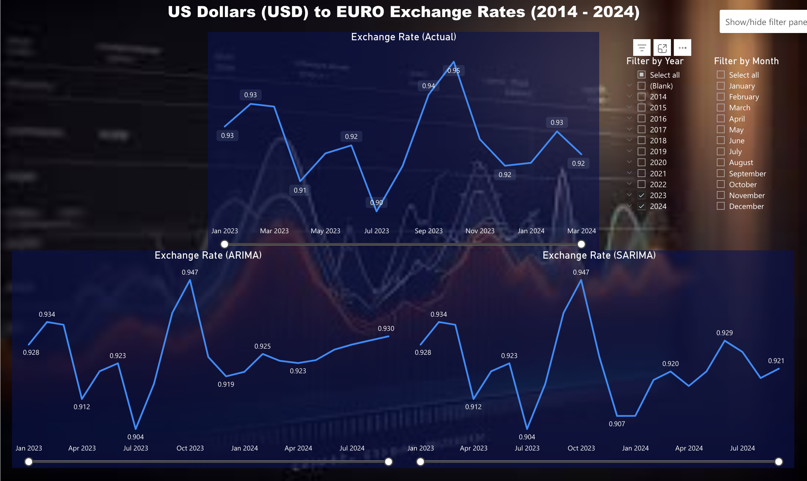
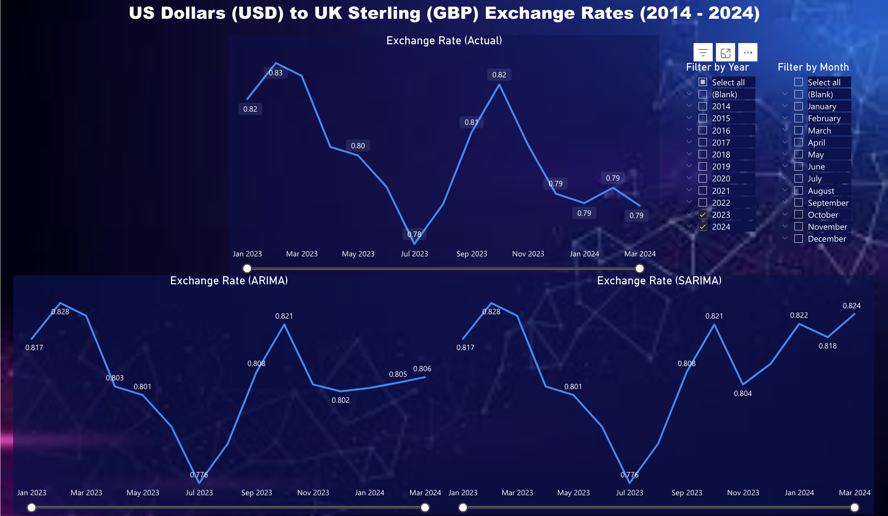
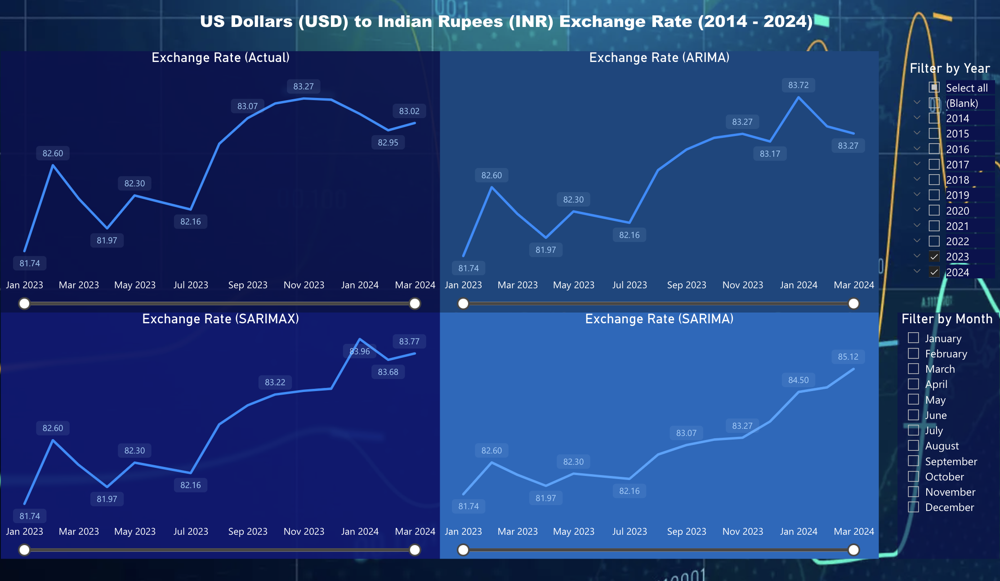
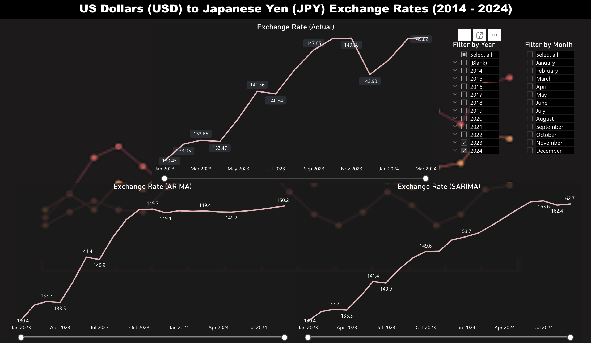

# Exchange Rate Time-Series Analysis using SARIMAX models

## Motivation

This project involved analyzing and forecasting the US Dollar's exchange rate with five key currencies: Euro (EUR), British Pound (GBP), Indian Rupee (INR), Chinese Yuan (CNY), and Japanese Yen (JPY). We applied ARIMA, SARIMA, and SARIMAX models, evaluating their performance to determine the most accurate for predictions. The project also features an interactive Power BI dashboard, offering a clear visual representation of both historical and forecasted exchange rates for better insights.

## Objective

In this project, we analyzed, modeled, and forecasted exchange rate ratios of US Dollars with five other currencies - `Euro (EUR)`, `UK Pound (GBP)`, `Indian Rupees (INR)`, `Chinese Yuan (CHY)`, and `Japanese Yen (JPY)`. We used `ARIMA`, `SARIMA`, and `SARIMAX` models, and compared the accuracies of each model to determine the most reliable one. We also created an interactive MS Power Bi Dashboard that shows the time-series - historical and forecasted - to analyze the information visually.

## Data

Data is gathered from https://fred.stlouisfed.org using the FRED API. In this project, we consider 5 currencies - Euro, Japanese Yen, Indian Rupees, UK Pound Sterling, and Chinese Yuan.
The exchange rate in the collected data has a frequency of `Month` and is the average of the daily exchange rates.

The FRED API provides the exchange rate as a ratio of the two currencies based on the value of them compared to the other. The currencies with a value greater than USD are expressed as Currency/USD and those with lesser value are expressed as USD/Currency.

Countries with exchange rate in Currency/USD ratio:

- Euro
- United Kingdom
- China

***India and Japan have USD/Currency ratio.***

## Data Cleaning and Pre-processing

The dataset from FRED API is clean without any missing values. The pre-processing of the datasets involved stationarizing the non-stationary data.

We did the following methods to make the datasets stationary - 

1. Seasonal Decomposition
2. Differencing

The datasets were confirmed to stationary using teh following methods - 

1. Augmented Dickey-Fuller Test
2. Auto-correlation and Partially Auto-correlation Function
3. Rolling Mean and Standard Deviation

## ARIMA model

ARIMA (AutoRegressive Integrated Moving Average) forecasting is a time series forecasting method that combines autoregressive (AR), differencing (I), and moving average (MA) components to model and predict future values of a time series.

Here's a brief overview of each component:

1. **AutoRegressive (AR) Component:** This component models the relationship between an observation and a fixed number of lagged observations. The term "autoregressive" indicates that the model is regressing the variable on its own lagged values.

2. **Integrated (I) Component:** This component involves differencing the time series to make it stationary, which means removing any trend or seasonality present in the data. The differencing order (denoted by "d") specifies how many times the data is differenced to achieve stationarity.

3. **Moving Average (MA) Component:** This component models the relationship between an observation and a residual error term based on a moving average of past errors. The term "moving average" refers to the averaging of past error terms in the model.

The ARIMA model is denoted as ARIMA `(p, d, q)`, where:

- `p` represents the order of the autoregressive component (AR).
- `d` represents the degree of differencing needed to make the series stationary.
- `q` represents the order of the moving average component (MA).

The ARIMA model captures time series patterns, including trend, seasonality, and other temporal dependencies. We use the differenced data for the analysis and pass `ARIMA(p, 0, q)`, however, it is first degree differenced. 

## SARIMA model

In SARIMA (Seasonal AutoRegressive Integrated Moving Average) forecasting, the seasonal order refers to the seasonal components of the model. Specifically, it includes the seasonal autoregressive (SAR), seasonal differencing (D), and seasonal moving average (SMA) terms.

The seasonal order is denoted as `(P, D, Q, m)`, where:

- `P` is the order of the seasonal autoregressive (SAR) component.
- `D` is the degree of differencing for the seasonal component.
- `Q` is the order of the seasonal moving average (SMA) component.
- `m` is the number of time steps in each seasonal period.

Here's a brief explanation of each component:

1. **Seasonal Autoregressive (SAR) component `P`:** It represents the relationship between the observation and a certain number of lagged observations in previous seasonal periods.

2. **Seasonal Differencing `P`:** It refers to differencing the series by subtracting the observation from the same season of the previous year. This is done to remove the seasonal component from the series.

3. **Seasonal Moving Average (SMA) component `Q`:** It represents the relationship between the observation and the residual errors from a moving average model applied to lagged observations in previous seasonal periods.

4. **Seasonal Period `m`:** It specifies the number of time steps in each seasonal cycle. For example, if the data exhibits a yearly seasonality, `m` would typically be 12 for monthly data (12 months in a year) or may be a some t time.

Together, the seasonal order determines how the seasonal patterns in the data are captured and modeled in SARIMA forecasting. Choosing the appropriate values for \( P \), \( D \), \( Q \), and \( m \) requires analyzing the seasonality in the data and experimenting with different combinations to find the model that best fits the data and yields accurate forecasts.

## SARIMAX model

`SARIMAX` modeling requires exogenous variables that contribute to the change in the endogenous variable. This requires extensive subject matter knowledge, therefore, we restricted ourselves to the forecasting of USD/INR only.

### Exogenous Variables

We forecast foreign exchange rates using SARIMAX with inflation, interest rates, and trade-transactions as exogenous variables. However, these are generic and therefore, we used indicators for each of these.

`Inflation`: For inflation, we used Consumer Price Index (CPI) as the indicator. We obtained the most significant CPI for US and India for modeling. In US, the total Urban consumers is considered to have greatest weightage. In India, All items category of CPI has the greatest weightage.

`Interest Rates`: For interest rates, we used the Federal Funds Rate for US and 10-Year Long-Term Government Bond Yields for India as indicators. 

`Current Account Balance`: The third indicator we used was the Balance of Payments in the current account as a percent of GDP for both the countries

We gathered all the datasets from the FRED using their Python API. Here are the specific FRED series codes for each category:

<b>Inflation</b>:

Consumer Price Index for All Urban Consumers (US): `CPIAUCNS`

Consumer Price Index for All Items (IND): `INDCPIALLMINMEI`

<b>Interest Rates</b>:

Effective Federal Funds Rate (US): `FEDFUNDS`

10-Year  Long-Term Government Bond Yields (IND): `INDIRLTLT01STM`

<b>Trade Transactions</b>:

Balance of Payment - Current Account (US) as a % of GDP: `USAB6BLTT02STSAQ`

Balance of Payment - Current Account (IND) as a % of GDP: `INDB6BLTT02STSAQ`

## Performance Metrics

|ARIMA| | | |SARIMA | | ||
|--|---|---|---|---|---|---|---|
|Currency|	MAE	|MSE	|RMSE	|Currency	|MAE|	MSE	|RMSE|
|Euro	|0.012929	|0.000251|	<b>0.015857</b>	|Euro|	0.014350|	0.000278	|0.016687|
|UK Pound	|0.013713	|0.000249|	0.015792	|UK Pound|	0.014054|	0.000251|	<b>0.015840</b>|
|Indian Rupees	|0.561540|	0.470815	|<b>0.686160</b>|	Indian Rupees	|0.650252|	0.572051	|0.756340|
|Japanese Yen	|2.547739	|10.217898	|<b>3.196545</b>|	Japanese Yen	|2.834048	|11.263803|	3.356159|
|Chinese Yuan	|0.001559|	0.000004	|0.002056|	Chinese Yuan	|0.001310	|0.000003	|<b>0.001841</b>|

|Model|  ARIMA| | | |SARIMA |  || | SARIMAX| | |
|--|---|---|---|---|---|---|---|--|--|--|--|
|Metric|	MAE	|MSE	|RMSE| |MAE|	MSE	| RMSE|	|MAE|	MSE	|RMSE|
|Indian Rupees	|0.561540|	0.470815	|0.686160|	|0.650252|	0.572051	|0.756340| | 0.456647 | 0.422422|  <b>0.64994</b>|

Based on the provided MAE, MSE, and RMSE values for ARIMA and SARIMA models for different currencies, we can interpret the performance as follows:

1. **Euro**:
   - For ARIMA: MAE = 0.012929, MSE = 0.000251, RMSE = 0.015857
   - For SARIMA: MAE = 0.014350, MSE = 0.000278, RMSE = 0.016687
   - In this case, the ARIMA model has lower MAE, MSE, and RMSE values compared to SARIMA, indicating better performance.

2. **UK Pound**:
   - For ARIMA: MAE = 0.013713, MSE = 0.000249, RMSE = 0.015792
   - For SARIMA: MAE = 0.014054, MSE = 0.000251, RMSE = 0.015840
   - Similar to the Euro, the ARIMA model outperforms SARIMA for the UK Pound based on lower MAE, MSE, and RMSE.

3. **Indian Rupees**:
   - For ARIMA: MAE = 0.561540, MSE = 0.470815, RMSE = 0.686160
   - For SARIMA: MAE = 0.650252, MSE = 0.572051, RMSE = 0.756340
   - For SARIMAX: MAE = 0.456647, MSE = 0.422422, RMSE = 0.64994
   - In this case, all the three models have relatively high error metrics, but SARIMAX performs slightly better based on lower MAE, MSE, and RMSE.

4. **Japanese Yen**:
   - For ARIMA: MAE = 2.547739, MSE = 10.217898, RMSE = 3.196545
   - For SARIMA: MAE = 2.834048, MSE = 11.263803, RMSE = 3.356159
   - Similar to the Indian Rupees, both models have high error metrics, but ARIMA performs slightly better based on lower MAE, MSE, and RMSE.

5. **Chinese Yuan**:
   - For ARIMA: MAE = 0.001559, MSE = 0.000004, RMSE = 0.002056
   - For SARIMA: MAE = 0.001310, MSE = 0.000003, RMSE = 0.001841
   - ARIMA outperforms SARIMA for Chinese Yuan based on lower MAE, MSE, and RMSE.

Overall, in most cases, the ARIMA model tends to perform slightly better than the SARIMA model based on the provided error metrics. However, the performance clearly depends on the specific characteristics of each currency's exchange rate data.

## Findings

Throughout the Time-series analysis and forecasting, we found the following observations -

1. **USD/Euro data**

    |ARIMA| SARIMA|
    |--|--|
    |The model forecasted that the USD will gain more value as compared to Euro in the coming 10 months|The model forecasted that the USD will gain more value as compared to Euro in the coming 10 months|
    |Forecasts December 2023, January, February, and March 2024 accurately! |The forecasting is not as accurate as ARIMA although the trend is accurately captured.|
    
    
    
    
    
2. **USD/GBP data**

    |ARIMA| SARIMA|
    |--|--|
    |The model forecasted that the USD will achieve a steady rise against UK in the coming 10 months|The model forecasted that the USD will gain more value as compared to GBP in the coming 10 months, although not consistent|
    |Fails to capture the trend for rates in December 2023, January, february, and March 2024! |The forecasting is not as accurate as the trend is not captured accurately.|
    
    

3. **USD/INR data**

    |ARIMA| SARIMA|SARIMAX|
    |--|--|--|
    |The model shows that the USD currency value tends to remain steady as compared to INR over the next 10 months |The model forecasted that the USD will gain a steep rise against INR in the coming 10 months with June 2024 at the peak|The model forecasts a slight increase in USD value against INR over the 10 months with fluctuations throughout the months
    |Fails to capture the trend over the months! |Shows a steady rise in USD value failing to capture the trend|The forecasting is better than ARIMA and SARIMA, however, January 2024 forecasting is misleading|
    
    
    
    

4. **USD/JPY data**

    |ARIMA| SARIMA|
    |--|--|
    |The model forecasted that the USD will remain steady against JPY until June 2024 and then starts to rise|The model forecasted that the USD will climb up in value against JPY in the coming 10 months with July 2024 at the peak|
    |Fails to capture the trend and shows a steady rate! |Shows a upward trend as opposed to the actual fluctating trend, misses the dip in December 2023|
    
    
    
    
    
    
5. **USD/CHY data**

    |ARIMA| SARIMA|
    |--|--|
    |The model forecasted that the USD will drop in value as compared to CHY in the coming 10 months|The model forecasted that the USD will drop in value as compared to CHY in the coming 10 months, i.e, CHY strenghtens over this period|
    |Fails to capture the trend and shows a steady rate from december 2023! |The trend is captured correctly, however, misses the rise of rate in December 2023|
    
    

## Insights

- Among all the currencies, the Chinese Yuan tends to be in the strengthening phase against US Dollars. 
- The strengthening phase of Chinese Yuan will be a good opportunity for investing in U.S. exporting companies dealing with Chinese Exports as they can sell the goods at a lower price in China.
- The Chinese buyers can get more goods from the US Exporters for the same Chinese Yuan during the Weak Dollar phase.
- The US can attract more tourists from China during the weak dollar phase and it can be a boon for the tourism industry in US.
- For the other countries and EU, it's a strong dollar period and they would gain from exporting goods to US.
- A US Investor investing in Chinese company will gain; A US investor investing in India, UK or EU will suffer loss!

## Conclusion

The foreign exchange rate between two countries determine the trade relations and investment strategies between the traders and investors in these countries.

When a weak dollar uplifts the investment, exporting and tourism industry in the US, it affects imports and domestic population by inflation.

## References

1. <a href = "https://www.fisdom.com/factors-affecting-rupee-dollar-exchange-rate/">Factors Affecting Rupee Dollar Exchange Rate</a>
2. <a href = "https://www.investopedia.com/articles/forex/08/weak-usd.asp#:~:text=A%20weaker%20dollar%2C%20however%2C%20can,investing%20in%20U.S.%20exporting%20companies.">Weak Dollar Impacts</a>
3. <a href = "https://courses.lumenlearning.com/wm-macroeconomics/chapter/strengthening-and-weakening-currency/">Strengthening and Weakening Currencies</a>
4. <a href = "https://medium.com/@dagorhan20/usd-try-next-30-days-with-sarimax-a11bbb4a7a00">SARIMAX Forecasting USD/TRY</a>
5. <a href = "https://www.analyticsvidhya.com/blog/2023/06/sarima-model-for-forecasting-currency-exchange-rates/"> SARIMA Forecasting of Foreign Exchange Rates</a>

## Data Sources

 We employed the FRED API for Python to gather live data from the FRED open-source database.

 
1. Organization for Economic Co-operation and Development, Balance of Payments BPM6: Current Account Balance: Total Balance as Percent of GDP for United States [USAB6BLTT02STSAQ], retrieved from FRED, Federal Reserve Bank of St. Louis; https://fred.stlouisfed.org/series/USAB6BLTT02STSAQ, March 27, 2024.

2. Organization for Economic Co-operation and Development, Consumer Price Index: All Items: Total for India [INDCPIALLMINMEI], retrieved from FRED, Federal Reserve Bank of St. Louis; https://fred.stlouisfed.org/series/INDCPIALLMINMEI, March 27, 2024

3. Organization for Economic Co-operation and Development, Interest Rates: Long-Term Government Bond Yields: 10-Year: Main (Including Benchmark) for India [INDIRLTLT01STM], retrieved from FRED, Federal Reserve Bank of St. Louis; https://fred.stlouisfed.org/series/INDIRLTLT01STM, March 31, 2024

4. Organization for Economic Co-operation and Development, Balance of Payments BPM6: Current Account Balance: Total Balance as Percent of GDP for India [INDB6BLTT02STSAQ], retrieved from FRED, Federal Reserve Bank of St. Louis; https://fred.stlouisfed.org/series/INDB6BLTT02STSAQ, April 5, 2024

5. U.S. Bureau of Labor Statistics, Consumer Price Index for All Urban Consumers: All Items in U.S. City Average [CPIAUCSL], retrieved from FRED, Federal Reserve Bank of St. Louis; https://fred.stlouisfed.org/series/CPIAUCSL, March 27, 2024

6. Board of Governors of the Federal Reserve System (US), Federal Funds Effective Rate [FEDFUNDS], retrieved from FRED, Federal Reserve Bank of St. Louis; https://fred.stlouisfed.org/series/FEDFUNDS, April 1, 2024

7. Board of Governors of the Federal Reserve System (US), Indian Rupees to U.S. Dollar Spot Exchange Rate [EXINUS], retrieved from FRED, Federal Reserve Bank of St. Louis; https://fred.stlouisfed.org/series/EXINUS, April 2, 2024

